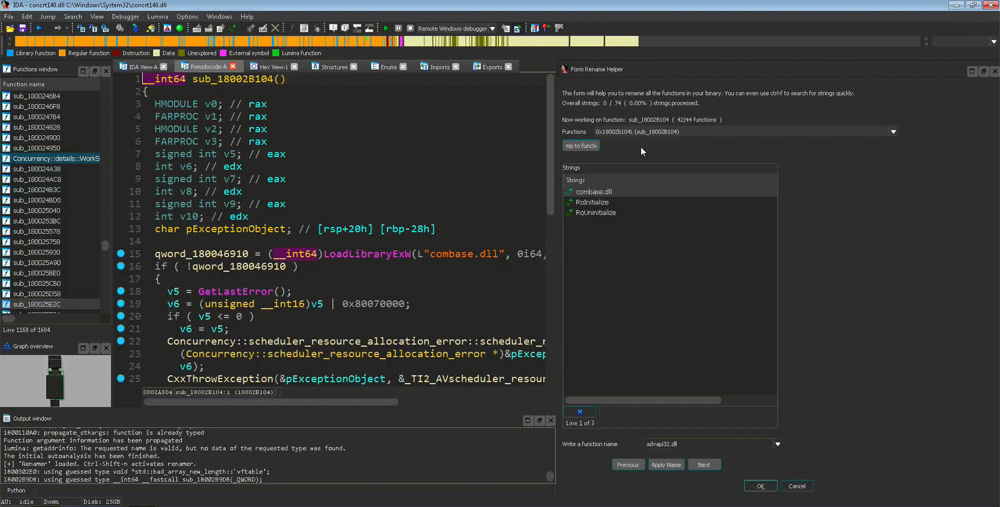

# Renamer
A plugin which helps in the process of naming functions based on their strings.

## How does it work
The plugin walks you through all the functions in your binary. For each function it shows you what are the available strings in the function and let you choose what is the appropriate name for that function. Upon choosing name you'll jump to the next function.

The default hot-key to activate the plugin is `Ctrl-Shift-N`.

## Installation
Copy `renamer.py` to IDA plugin's directory, usually at: `C:\Program Files\IDA\plugins`

## Tested versions
- v7.3

## Known Issues

**AttributeError: ‘module’ object has no attribute ‘MAXSTR’**

Some users report they receive a traceback related to MAXSTR not being found. It'a a bug in some versions of IDAPython API, specifically in the function `SetControlValue` which seems have broken in some API migration.
>   File "C:\Program Files\IDA Pro 7.3\python\ida_kernwin.py", line
> 6924, in SetControlValue  
>     tid, _ = self.ControlToFieldTypeIdAndSize(ctrl)     File "C:\Program Files\IDA Pro 7.3\python\ida_kernwin.py", line 6951, in
> ControlToFieldTypeIdAndSize  
>     return (3, min(_ida_kernwin.MAXSTR, ctrl.size)) 
>     AttributeError: 'module' object has no attribute 'MAXSTR'

The solution is to manually edit `C:\Program Files\IDA Pro 7.x\python\ida_kernwin.py` and replace  `_ida_kernwin.MAXSTR` with some big number (e.g. 65536).